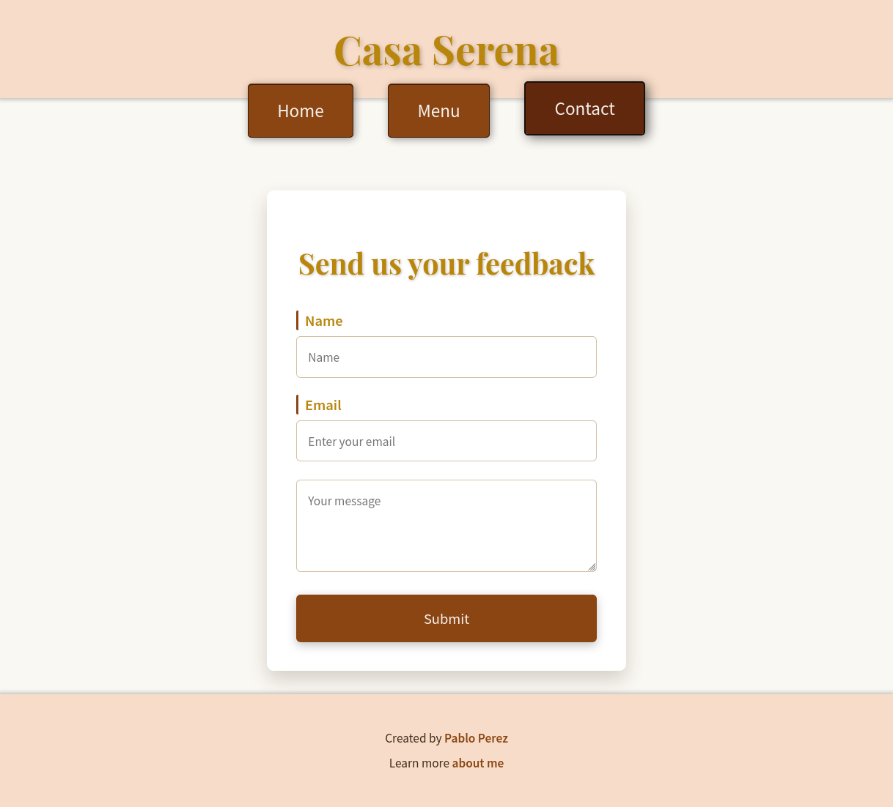

# 🇪🇸 Casa Serena - Spanish Fine Dining Restaurant

> **A sophisticated restaurant website showcasing Spanish cuisine with modern flair**

## 📖 About

Casa Serena is an elegant Spanish fine dining restaurant website that blends traditional Spanish culinary heritage with contemporary global influences. Located in the heart of Barcelona, this project demonstrates modern web development techniques.

**Project Link**: [The Odin Project - Restaurant Page](https://www.theodinproject.com/lessons/node-path-javascript-restaurant-page)

## ✨ Features

### 🎨 **Design & User Experience**
- **Elegant Typography**: Playfair Display for headings, Source Sans Pro for body text
- **Spanish Color Palette**: Warm creams, rich browns, and golden accents
- **Responsive Design**: Optimized for desktop, tablet, and mobile devices
- **Smooth Animations**: Subtle hover effects and transitions
- **Professional Layout**: Clean, restaurant-quality aesthetic

### 🍽️ **Restaurant Features**
- **Home Page**: Hero image with compelling tagline and restaurant introduction
- **Menu Page**: Interactive menu cards with images and descriptions
- **Contact Page**

### 🛠️ **Technical Features**
- **Webpack Bundle**: Modern build process with asset optimization
- **Modular CSS**: Separate stylesheets for each page component
- **ES6 Modules**: Clean, maintainable JavaScript architecture

## 🚀 Technologies Used

### **Frontend**
- 
- 
- 

### **Build Tools**
- 
- 

### **Styling**
- **Google Fonts**: Playfair Display & Source Sans Pro
- **CSS Grid & Flexbox**: Modern layout techniques
- **Media Queries**: Responsive breakpoints
- **CSS Animations**: Smooth transitions and effects

## 🌟 Key Learning Outcomes

- **Webpack Configuration**: Module bundling and asset management
- **CSS Architecture**: Modular stylesheets and responsive design
- **JavaScript Modules**: ES6 import/export patterns

## 📸 Screenshots

- **Home**

- **Menu**

- **Form**

## 👨‍💻 Author

**Pablo Perez**
- GitHub: [@yaoming16](https://github.com/yaoming16)
- Portfolio: [yaoming16.github.io](https://yaoming16.github.io/)

## 🙏 Acknowledgments

- **The Odin Project**: For the comprehensive web development curriculum

